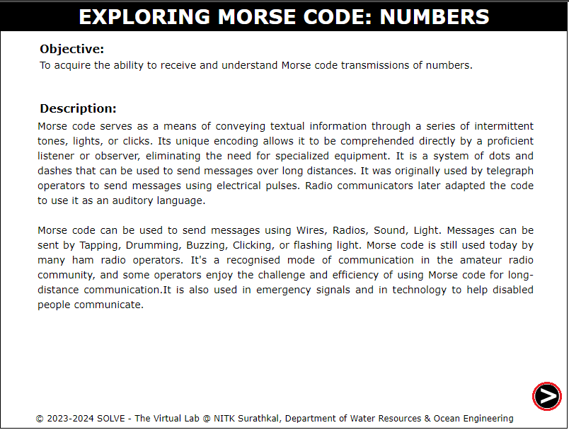
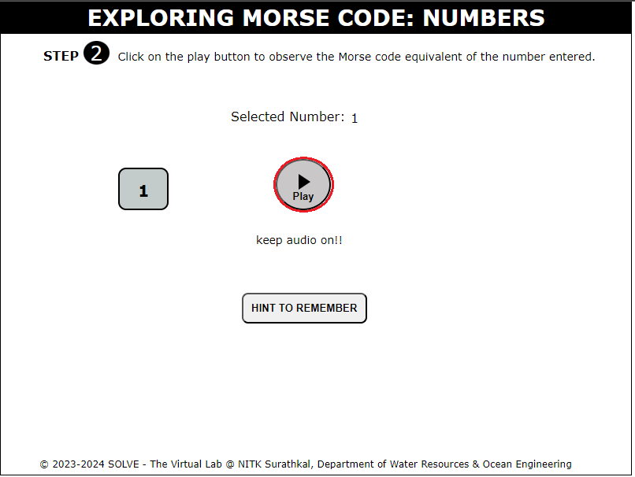

### These procedure steps will be followed on the simulator:

1.Open the simulation of Morse code Syntax by navigating through the introductory paragraph,and then proceed by selecting the next button located at bottom right corner.

  

2.Select the MorseCode Sytax and click submit button.

3.Click on the play button to play the morse code.

4.After the display of morse code, click on repeat button. It will redirect to STEP1 for selecting a new Morse Code Syntax.

 
 
